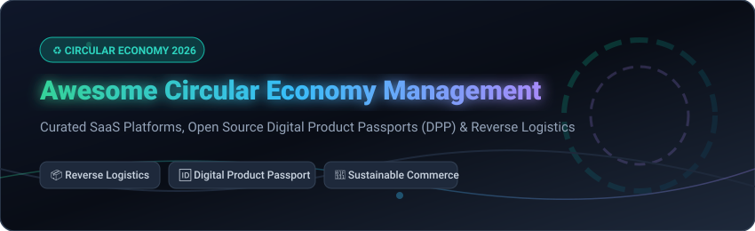

  

  
  
  
  
  

# ♻️ Awesome Circular Economy Management

> **Curated ecosystem of enterprise SaaS platforms, open-source software, Digital Product Passport (DPP) frameworks, and reverse logistics tools for sustainable supply chain management.**

Language: **English** | [中文 (Chinese)](README_zh-CN.md)

---

## 📌 Executive Overview & Market Context

This repository tracks leading enterprise **SaaS software** and **open-source GitHub projects** in the field of **circular economy management**, **Digital Product Passports (DPP)**, **reverse logistics**, **supply chain traceability**, and **recommerce**.

These solutions empower modern enterprises, sustainability managers, and software engineers to optimize product lifecycles, comply with EU Ecodesign for Sustainable Products Regulation (ESPR), reduce industrial material waste, and streamline end-to-end return operations.

---

## 📋 Table of Contents

- [📊 SaaS & Hosted Enterprise Platforms](#-saas--hosted-enterprise-platforms)
- [💻 Open Source GitHub Projects](#-open-source-github-projects)
  - [🆔 Digital Product Passports (DPP) & Traceability](#-digital-product-passports-dpp--traceability)
  - [📦 Reverse Logistics & Returns Management](#-reverse-logistics--returns-management)
  - [🌱 Circular Commerce & Resale Markets](#-circular-commerce--resale-markets)
- [📈 Star History](#-star-history)
- [🤝 Support & Sponsorship](#-support--sponsorship)
- [🛠️ How to Contribute](#️-how-to-contribute)
- [⚖️ Disclaimer](#️-disclaimer)

---

## 📊 SaaS & Hosted Enterprise Platforms

> 💡 **Market Size & Structure**: The global Circular Economy Management & Digital Product Passport (DPP) market is estimated at **$12.5 Billion** (as of 2026) and is **moderately fragmented**, featuring specialized leaders across reverse logistics, textile provenance, and raw material traceability.

The table below summarizes leading commercial platforms sorted by **Company Size (Revenue / Valuation)** in descending order:

| 🏢 Product | 📝 Description | 📈 Company Size (Revenue / Valuation) | 💵 Specific Starting Pricing | 🎁 Free Tier / Free Trial Limits |
| :--- | :--- | :--- | :--- | :--- |
| **[Reconomy](https://www.reconomy.com/)** | Global circular economy provider offering outsourced waste management, compliance services, and resource tracking for enterprise supply chains. | **~£1.2B ($1.5B+) Revenue** *(PE-Backed)* | **£1,500/month** base service contract | **No free tier**; 30-day demo sandbox available upon request. |
| **[Optoro](https://www.optoro.com/)** | AI-driven reverse logistics and returns management platform maximizing returns recovery value for global retailers and 3PLs. | **~$100M ARR** *($246M+ Funding)* | **$2,500/month** Enterprise Tier starting plan | **No permanent free tier**; 14-day guided proof-of-concept trial. |
| **[Worldly](https://worldly.io/)** | Primary sustainability data platform (formerly Higg) delivering carbon footprint intelligence and ESG disclosure across supply chains. | **~$40M ARR** *($72M Raised)* | **$1,200/year** Vendor Essentials plan | **Free vendor portal upon invitation** (limited to 1 facility data entry). |
| **[ReverseLogix](https://www.reverselogix.com/)** | End-to-end returns management system (RMS) providing automated workflows for returns, warranty repairs, and secondary disposition. | **~$25M ARR** *($20M Raised)* | **$3,000/month** Enterprise Starter plan | **No free tier**; 30-day sandbox trial available upon sales approval. |
| **[EON](https://www.eon.xyz/)** | Enterprise Digital ID platform creating serialized product digital twins and cloud-linked product passports for retail and fashion brands. | **~$100M Valuation** *($20.5M Raised)* | **$1,500/month** Product Cloud Pilot plan | **No free tier**; 30-day pilot program for up to 1,000 digital product IDs. |
| **[Reflaunt](https://www.reflaunt.com/)** | Resale-as-a-Service (RaaS) technology embedding brand-owned circular secondary marketplaces directly into fashion e-commerce sites. | **~$35M Valuation** *($14.4M ARR)* | **$500/month** + 5% transaction revenue share | **No free plan**; 14-day integration demo sandbox trial. |
| **[Loop Returns](https://loopreturns.com/)** | E-commerce returns management platform specializing in Shopify return portals, exchange incentives, and refund automation. | **~$340M Valuation** *($15M ARR)* | **$165/month** (Essential Plan starting tier) | **14-day free trial** on Shopify (capped at 50 processed returns). |
| **[Circularise](https://www.circularise.com/)** | Blockchain-based raw material traceability and Digital Product Passport platform with zero-knowledge selective data sharing. | **~$5.7M ARR** *($11M Funding)* | **€850/month** Starter Node tier | **No free tier**; 30-day developer testnet trial available. |
| **[Trace For Good](https://traceforgood.com/)** | Textile supply chain traceability SaaS delivering material provenance verification, supplier mapping, and EU compliance reporting. | **~$2M ARR** *($4.2M Funding)* | **€450/month** Starter Tier | **No free tier**; 14-day compliance assessment trial. |
| **[Cycle Platform](https://www.cycle.app/)** | Circular economy SaaS managing deposit-refund systems (DRS) and smart return infrastructure for reusable packaging loops. | **~$1M ARR** *(Seed Funded)* | **$299/month** Reusable System Tier | **14-day free trial** for municipal and enterprise packaging pilots. |

---

## 💻 Open Source GitHub Projects

> 🌟 Open-source tools for circular economy management, Digital Product Passport (DPP) servers, and optimization libraries. Sorted by **GitHub Star Count** descending.

### 🆔 Digital Product Passports (DPP) & Traceability

- **[digital-product-pass](https://github.com/eclipse-tractusx/digital-product-pass)** 
  **Eclipse Tractus-X reference implementation for Digital Product Passports (DPP).** Provides standard-compliant visualization for Battery Passports, Transmission Passports, and EcoPass KITs within Catena-X networks. Tech stack: Angular, Java, Docker. **Apache-2.0**.

- **[freeDPP](https://github.com/OttoHandle/freeDPP)** 
  **Minimal standard-conformant DPP server implementation.** Built on C# / .NET Core, providing CEN/CENELEC standard-compliant REST API servers for Digital Product Passport metadata and lifecycle verification. **MIT License**.

- **[openepcis-models](https://github.com/openepcis/openepcis-models)** 
  **Java models for GS1 EPCIS 2.0 and CBV 2.0 supply chain traceability.** Essential open-source data model binding for Jackson (JSON-LD) and JAXB (XML) for tracking supply chain movement and event histories. **Apache-2.0**.

- **[dpp-demonstrator](https://github.com/iotaledger/dpp-demonstrator)** 
  **IOTA DLT-based Digital Product Passport demonstrator.** Demonstrates tamper-proof product identity verification and immutable lifecycle event logging over decentralized ledgers. **Apache-2.0**.

- **[DPP01](https://github.com/arcticscihub/DPP01)** 
  **Open-source DPP framework for food producers & manufacturers.** Features structured record generation (material composition, sourcing, usage), EU DPP compliance support, and AWS DevOps deployment scripts. **Open Source**.

- **[mycelix-supplychain](https://github.com/Luminous-Dynamics/mycelix-supplychain)** 
  **Decentralized supply chain system with Byzantine Fault Tolerant consensus.** Converts ERP/IoT events into signed portable Verifiable Credentials (VCs) with selective disclosure (SD-JWT/BBS+). **Rust Core + TypeScript SDK**. **Apache-2.0**.

- **[TraceFlow](https://github.com/Cao150702/traceflow)** 
  **Decentralized item traceability system with AI anomaly detection.** Generates QR-linked product passports on Polygon with GPT-4o-mini powered scan verification. **Next.js 14, Supabase, Polygon**.

---

### 📦 Reverse Logistics & Returns Management

- **[PV_ICE](https://github.com/NatLabRockies/PV_ICE)** 
  **NREL tool to quantify Photovoltaic (PV) mass flows in the Circular Economy.** Models module reliability, degradation, lifetime, and end-of-life recycling material flows. **Python / Open Source**.

- **[RELOG](https://github.com/ANL-CEEESA/RELOG)** 
  **Reverse logistics optimization framework by Argonne National Laboratory.** Uses Mixed-Integer Linear Programming (MILP) to optimize facility location, recycling plant capacities, and transportation pathways for critical material recovery (EV batteries, e-waste, plastics). **Python / JuMP / Open Source**.

- **[Dolibarr Returns & RMA Modules](https://github.com/zacharymelo/doli-returns)** 
  **Free reverse logistics suite for SMEs built for Dolibarr ERP.** Four synergistic modules for managing customer returns into stock, RMA warranty tracking, customer inventory, and box labels. **GPL-3.0**.

- **[ROBOSTAPLE](https://github.com/pacobaco/robostable)** 
  **Distributed reverse logistics operating system.** Turns neighborhood nodes into programmable inventory hubs using event-driven routing and AI demand prediction. **Open Source**.

---

### 🌱 Circular Commerce & Resale Markets

- **[Phoenix Project](https://github.com/The-PhoenixProject/The-Phoenix-Project-Front-end)** 
  **Open-source secondary marketplace connecting eco-conscious buyers & sellers.** Features upcycling catalog, secondhand product listings, Socket.IO real-time chat, and eco-reward points. **React, Node.js, ISC License**.

- **[ZeroWaste](https://github.com/jessem8/zerowaste)** 
  **Community circular economy and item swap marketplace.** Designed for neighborhood sharing, upcycling project guides, and local waste reduction. Aligned with UN SDG 12. **PHP, MySQL, Tailwind CSS**.

---

## 📈 Star History

---

## 🤝 Support & Sponsorship

Thank you for exploring and using **Awesome Circular Economy Management**! If this repository has helped your research, business, or open-source projects, please consider supporting its ongoing maintenance:

- ⭐ **Star this repository** to help others discover circular economy tools.
- 🔀 **Fork & Share** with your colleagues and circular economy communities.
- ☕ **Sponsor / Buy me a coffee**: If you'd like to support open-source sustainability curation, visit the [GitHub Sponsor Dashboard](https://github.com/sponsors/ishandutta2007).

---

## 🛠️ How to Contribute

1. Fork the repository.
2. Add/edit entries in `README.md` following the standard table and badge formatting.
3. Keep descriptions objective, factual, and backed by official web or repository sources.
4. Submit a Pull Request (PR) detailing your proposed additions.

---

## ⚖️ Disclaimer

- This list is **community-curated** for educational and research purposes. Inclusion does not imply official endorsement.
- Ensure full compliance with relevant local and international sustainability frameworks, including EU Digital Product Passport (DPP) mandates and ESPR directives.
